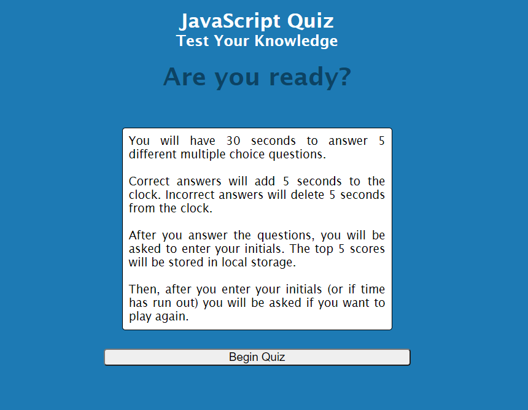

# RMOatman-JavaScript Quiz

https://rmoatman.github.io/Oatman_JavaScript_Quiz

## Description
~~~
The intent of this project was to build a timed coding quiz with multiple-choice questions.  The application runs in the browser and features dynamically updated HTML and CSS powered by JavaScript code.

When the user clicks the start button, the timer begins and the user is presented with a question.  Once the user selects an answer, another question appears.  Correct questions increase the timer by 5 seconds.  Incorrect questions decrease the timer by 5 seconds.  This continues until all the questions are answered or the timer reaches 0.

If the user has a score greater than 0, he or she will be prompted to enter their initials.  The top 5 scores are stored locally.  If the user's score is in the top 5, the local scores will be updated and the top 5 scores are then displayed on screen and the user is prompted to play again. 

If the user runs out of time, they will be prompted to play again.

The core skills demonstrated in this project include:
    -   updating the DOM using JavaScript
    -   using setTime, setInterval, and clearInterval to create a timer
    -   utilizing multiple JavaScript files and sharing variables between each
    -   setting, getting, and updating local storage
    -   using JSON parse to store an object and JSON stringify to convert it to a string
    -   using sort and splice methods to identify and keep the 5 high scores
~~~

## Application and Reflection
~~~
This was the most difficult coding challenge, yet.  I began by creating several versions of pseudo-code.  Then, I sketched out a DOM tree to help identify the elements I wanted to manipulate.  Next, I created a road map of sorts regarding what needed to be done in what order. 

For example: 
    1. Code the HTML
    2. Identify the variables to use in CSS
    3. Create placeholders for the questions (writing the actual questions came last)
    4. Create a loop that cycles through the questions and evaluates the answer
    5. Create the timer
    6. Write the code used to identify the high scores
    7. Solve how to store and recall the high scores to and from local storage

Finally, I tested many scenarios with multiple combinations of: scores in local storage/no scores in local storage; time runs out; score qualifies for high score/score doesn't qualify for high score; and no initials entered.  After the first round of testing, I realized the process would be more effective if I kept a log of the trials and the results.  

I had to supplement my learning by reading about and watching videos regarding storing objects in an array, traversing the DOM, and utilizing local storage.

Two areas that I believe can be improved is the "Check Answers" code beginning in script.js line 147 and the if (highscores.length > 4) and the conditional statement in script.js line 247.  Both are long and repetitive.  I tried several ways to create loops that would eliminate duplication, however, I was unsuccessful and was concerned about time constraints.  I wanted to turn in a working project on time.  I will come back to it in the future.
~~~

## Additional References
~~~
-  Timer code influenced by Bootcamp Example 09-Ins_Timers-Intervals script.js
-  Code for storing and retrieving high scores was influenced by James Q Quick's video "Build a Quiz App (8) - Save High Scores in Local Storage" https://www.youtube.com/watch?v=DFhmNLKwwGw
~~~

## Contact Information
~~~
- Raemarie Oatman
- raemarie.oatman@gmail.com
- https://www.linkedin.com/in/raemarieoatman
- https://github.com/rmoatman
~~~
# Oatman_JavaScript_Quiz
